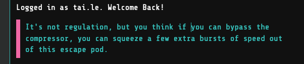
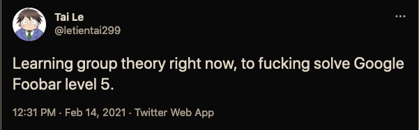
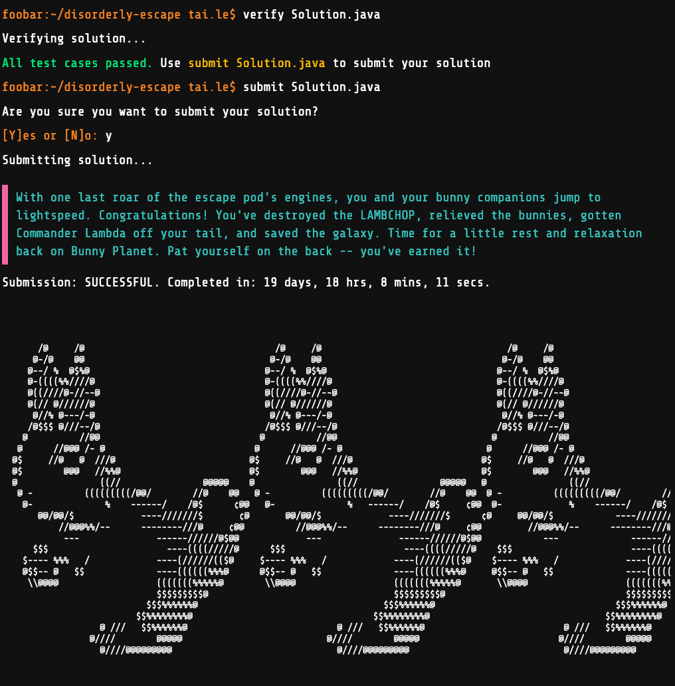

# My adventure on Google Foobar

Lesson learned:

- As with anything in Software Engineering, if we could resist the laziness, go
  with a boring solution first then progressively optimize it later, this would
  be done much sooner.

Table of Contents:

<!-- toc -->

- [About Foobar](#about-foobar)
- [My Foobar experience](#my-foobar-experience)
- [Bringing a gun to a guard fight](#bringing-a-gun-to-a-guard-fight)
- [Disorderly Escape](#disorderly-escape)
  - [Problem statement](#problem-statement)
  - [The journey](#the-journey)
    - [How naive I was](#how-naive-i-was)
    - [Is it a Graph problem?](#is-it-a-graph-problem)
    - [Return to "matrix configuration"](#return-to-matrix-configuration)
    - [Every problem has a solution on the Internet](#every-problem-has-a-solution-on-the-internet)
    - [Math is the true way](#math-is-the-true-way)
    - [Enlighten by Literate Programming](#enlighten-by-literate-programming)
  - [Helpful resources](#helpful-resources)
  - [What next?](#what-next)
- [PAQ (Potential Asked Questions)](#paq-potential-asked-questions)
- [Final words](#final-words)

<!-- tocstop -->

## About Foobar

Visit it here: https://foobar.withgoogle.com/

See also: [Things you should know about Google Foobar Invitation][about_foobar].

## My Foobar experience

I think different people might get different sets of challenges. It also depends
on when you do it. That said, take my opinions and experience below with a grain
of salt.

There are 5 levels, each has different numbers of problem to solve:

- Level 1: 1 problem, super easy.
- Level 2: 2 problems, easy.
- Level 3: 3 problems, still easy. In fact, these 3 problems took me the least
  of time. By the time you finish this, Foobar will ask for your resume and
  contact information (as if Google doesn't already know them).
- Level 4: 2 problems, Medium to Hard. 4.1 is a graph one. 4.2 is Geometric
  Calculus. We will talk about it later.
- Level 5: 1 problem. It's not Hard. [Calling it's Hard is an offense to
  it!][its_a_fucking_beast].

Foobar gives us a very generous time limit for each problem. For Level 1, if I
remember correctly, we have 7 days. I thought that it was a joke, or perhaps
Google also looks for very young but smart kids, so they give us enough time to
learn the language. By the time I hit level 5, I did't like that joke anymore.

You can watch [the videos][videos] of me solving the first 7 problems (1.1 to
4.1) within 4 hours since entering Foobar. The first few minutes of each video
should show you full problem statements (and I guess that'll be the only
interesting bits for you). However, if you're comfortable with Medium level in
Leetcode, just ignore them.

Now, let's talk about the 2 most interesting problems.

## Bringing a gun to a guard fight

- [Problem statements and ideas can be found here.][gun_ideas]
- [My solution][my_gun_code]
- [Total time wasted here][time_wasted_meme]: **11h over 2 days**.

This one is not so hard, requires a bit of Geometric Calculus knowledge, which
is something I'm capable of. But I spend more than 10h thinking and solving an
entirely other problem by mistake: [The Laser gun and mirrored
room][bodyguards]. That puzzle is about _how many bodyguards do we, as the
Commander, need to block all beams?_ Foobar problem is about _how many vectors
can we shoot the Commander when our beam can travel a limited distance?_ Damn!

I recorded the first 1.5 hours on this one, but then threw it away since I know
I'll need more time than that, and you don't like to watch me struggling more
than 30m anyway.

## Disorderly Escape

This is my favorite problem. If not because of it, I wouldn't bother to write
about this journey.

- Here's [the code with detailed reasoning][my_matrix_code]. But I suggest that
  you should read the problem statement and think about it for a while before
  reading the code.
- Total time wasted here: **20 days** (too many hours to keep track).

### Problem statement

Let me try to phrase it in a simpler term instead of reuse the wordy statement
from Foobar.

Given a matrix of `W * H` size. Each cell can take a value from 1 to `S`
inclusively. 2 matrices are said to be in an **equivalence class** if we can
apply any number of the following transformations to turn one into the other:

- Swap any 2 columns
- Swap any 2 rows

Example of equivalence matrices with `W=3`, `H=2`, `S=2`:

```
100   010   001   100
010   100   100   001   ...
```

How many equivalence classes can be constructed knowing `W`, `H`, and `S`?

See [sample test cases here](./sample_test_cases.md).

### The journey

> Skip this section if you aren't interesting in the wrong approaches.

This section is structured to be read like a straight path from start to end.
However, in reality, it is not this well-organized, I went back and forth
between ideas various times. My feelings moved between hopeless and excited like
a pendulum. I believe anyone who has solved any non-trivial problem has a
similar experience.

#### How naive I was

With the observation that if `H=1`, we can change the problem statement to: _How
many ways to put W objects to S group_, which have a trivial solution using
[Star and Bar][star_and_bar] counting method. Since the role of `W` and `H` can
change, if there's a Dynamic Programming solution that needs a 2D memo matrix,
we already have the first row and first column. I also hadn't seen any DP
problem so far. This must be it!

I spend 3 days tapping my head against the wall on this approach.

#### Is it a Graph problem?

Day 4, no more hope for DP, I tried a new approach. What if this is a Graph
problem? We could consider each cell as a node directly connected to all other
cells in the same column and the same row. Our transformations preserve the
paths between nodes. Perhaps it's a Topological Sorting problem. If we could
generate all the matrices and sort them somehow, then it is solved.

This approach led me to depression.

#### Return to "matrix configuration"

I can't count how many times I looked at the statement and even the welcome
message for a hint, any hint.



In the Foobar statement, they use the term "matrix configuration". There is one
immutability that we can use:

- The number of cells with state `i` (for `1<=i<=S`) within each row and each
  column won't change. Let's call it row/column configuration.
- The _set_ of row/column configurations won't change.

So, we could calculate the 2 sets of configurations for rows and columns for
each matrix, then use it to compare them. The time complexity for this solution
would be terrible, but at least it's a valid solution. It should pass some test
cases and generate more test cases for my other solutions!

That brute force solution can't even get through the case `W=5, H=5, S=5` on my
machine.

#### Every problem has a solution on the Internet

My 2nd last resort is, obviously, to find other people's solutions for ideas.
Some searching led me to [this question][matrix_math_exchange] on
Math/StackExchange. I stop reading at the keyword **Burnside lemma** in the
accepted answer. That's all the hint I need.

Reading the [wiki article on Burnside lemma][wiki_burnside] for the first time
makes me wanna jump. "It's a Group Theory problem, a fucking Group Theory
problem". That's it. That's why all other kinds of Math I tried to apply didn't
work.

Read that article several more times make me wanna cry. "What language is it?
WTF".

For the record, I'm used to be a Math competitive student, used to read Advanced
Calculus for fun during high school (sadly, I didn't make it to the final round
of the Vietnam Mathematics Olympiad, otherwise, I would be a Mathematician now
instead of a Software Engineer).

I'm not a stranger to Math. But the language there is alien to me.

#### Math is the true way

I spent the next 2 weeks reading a couple of books, slides and watching videos
(see "Help resources" section below).



I think I understood the concepts, the lemma, and some other theorems. I could
solve some exercises, verify many other examples of Burnside's lemma
applications. But, for some reason, I still can't crack the matrix problem.

I read the answer on Math/Exchange, again and again, ignore all the code, just
try to decipher the math, still can't digest the logic. "Why would we need
`lcm` and `gcd`? What [OEIS sequences][oeis] have anything to do with this? Oh,
Maple, hello old friend, but I'm sorry that I don't want to look at you right
now!"

The Python code there, however, was helpful to show that my Brute Force solution
was wrong. "Damn, I couldn't even write a proper brute force."

#### Enlighten by Literate Programming

Since I'm almost run out of time (and mental energy) on this one, I decided to
give it one last shot. The best way to think in logic is to write down our
thought and verify one by one. I did it with pen and paper before, but I guess
it failed because I was too lazy to write down all the calculations. This is my
last chance. If it also fails, then, fine[!][fuck_it_im_not_fine_with_that]

This time, I need to do it differently, carefully, every single word must be
beautifully typed. This time, I need the strongest, heaviest weapon in my
programming toolbox: [Literate programming][literate_programming].

Thanks to Knuth, I succeed this time. All the logic was cleared. All the
questions were answered. All the local test cases passed. The moment my solution
passed Foobar tests, I can't help but [shout to the void on
Twitter][tw_foobar_pass].



### Helpful resources

Among many things I had read/watch, these are the most useful:

- [An introduction to group theory - Tony Gaglione][gt_book]: a good read, clear
  enough to grasp the concepts of Group Theory while short enough to finish it
  in several days (138 pages). [Pinter's A Book of Abstract Algebra][pinter] is
  another good one but it's much longer (400 pages) and doesn't have free PDF
  available.
- [Essence of Group Theory - videos on Youtube][gt_videos]: those videos offer
  another approach to Group Theory, which help me to strengthen my
  understanding.
- [Python solution by Kody Puebla][kody_python_code]. I only use it to generate
  test cases.

### What next?

There's one question stuck in my mind.

**Is there any [Closed-form expression][closed_form_expression] (CFE) for the answer?**.

I tried to search for them, even discover [a paper][pn_paper] for the CFE of
Number Partition function `p(n)` (related to function `numbersSumToN` in my
solution) from [a Math Exchange question in 2011][cfe_pn] (the wiki article
[Partition (number theory)][pn_wiki] isn't up-to-date regarding this). But I
have no luck in finding the CFE for this problem.

Math is beautiful and sometimes can be surprising. Consider how [Pi hiding in
prime regularities][pi_and_prime] and what [E][e_number] has anything to do with
[Counting Derangement][wiki_derangement], I believe such expression exists!

I think I'll put it out of my head for a while, revisit it in the future, with a
fresher mind and hopefully with more Math knowledge.

To the people at Google who use it for level 5, thank you, I can't wait for the
next time I need Group Theory in my life!

## PAQ (Potential Asked Questions)

**How to get the invitation?**

Just Google it :joy:.

**OK, so there's some trick to get invited. But why did you do that?**

I need a new game to play after finish work. And I'm already feeling bored with
Leetcode after solving 800+ problems there. Boredom brings the memory back, and I
was doing some random search that time. So I recalled about Foobar and decide:
"Why not?"

**Don't you have work to do? How could you spend so much time on this?**

Don't worry, I still make sure my [day work](shopee.sg) is done, only doing this
part-time at night and weekend. Honestly, I don't have many hobbies and already
deactivate my Facebook account, so I have spare time to burn.

**Did you Google the solutions?**

I search for 4.2 _after_ submitting the solution, to see if there's any smarter
solution. For level 5, we've talked about it in the previous sections.

**Did you get an email from Google after Level 3?**

Nope.

It's so easy (right now) to game the system for an invitation, and the solutions
for almost all problems can be found on the Internet. So, I think there are
already too many resumes submitted via Foobar, make Foobar less useful for
Google as a hiring tool. It's fortunate that they still keep the system around,
so we can play for fun.

I don't expect the email or interview, just feel cool to accomplish something I
couldn't have done 6 years ago. <!-- But interview me please! -->

## Final words

Despite calling it’s “wasted time”, I enjoy this adventure, thanks to anyone
keeping Foobar maintained. I hope that this repo could become popular so that
the Foobar team needs to use new problems, so we can have another journey.

If you enjoy reading this so-far, feel like working with people like me, and
your company is not hiring, then join us. [We're always hiring!][shopee_jobs]
[Contact me for referal][mail_me].

<!-- ref -->

[its_a_fucking_beast]: https://imgur.com/gallery/k7aPF19
[videos]: https://youtube.com/playlist?list=PLcuGpHQxfbJWt_1CbsL8w-knx7ZP9arDk
[gun_ideas]: https://peter-ak.github.io/2020/05/10/Brining_a_gun_to_a_guard_fight.html
[bodyguards]: https://github.com/letientai299/google-foobar-2021
[my_matrix_code]: ./java/src/main/java/com/foobar/disorderlyEscape/DisorderLyEscape.java
[my_gun_code]: ./java/src/main/java/com/foobar/gun/Gun.java
[gt_book]: ./resources/an-intro-to-group-theory-_-Tony-Gaglione.pdf
[kody_python_code]: ./resources/matrix_orbits.py
[pinter]: https://www.amazon.com/Book-Abstract-Algebra-Second-Mathematics/dp/0486474178
[gt_videos]: https://youtube.com/playlist?list=PLDcSwjT2BF_VuNbn8HiHZKKy59SgnIAeO
[wiki_derangement]: https://en.wikipedia.org/wiki/Derangement
[pi_and_prime]: https://www.youtube.com/watch?v=NaL_Cb42WyY
[e_number]: https://en.wikipedia.org/wiki/E_number
[about_foobar]: https://medium.com/plutonic-services/things-you-should-know-about-google-foobar-invitation-703a535bf30f
[time_wasted_meme]: https://stackoverflow.com/a/482129/3869533
[closed_form_expression]: https://en.wikipedia.org/wiki/Closed-form_expression
[cfe_pn]: https://math.stackexchange.com/q/48075/377831
[matrix_math_exchange]: https://math.stackexchange.com/q/2056708/377831
[pn_paper]: http://www.aimath.org/news/partition/brunier-ono.pdf
[pn_wiki]: https://en.wikipedia.org/wiki/Partition_(number_theory)
[star_and_bar]: https://en.wikipedia.org/wiki/Stars_and_bars_(combinatorics)
[wiki_burnside]: https://en.wikipedia.org/wiki/Burnside's_lemma
[oeis]: https://oeis.org/
[fuck_it_im_not_fine_with_that]: https://www.youtube.com/watch?v=5FjWe31S_0g
[shopee_jobs]: https://careers.shopee.sg/jobs/?region_id=&dept_id=109&limit=20&offset=0
[literate_programming]: https://en.wikipedia.org/wiki/Literate_programming
[tw_foobar_pass]: https://twitter.com/letientai299/status/1366055683800539137
[mail_me]: mailto:letientai299@gmail.com
